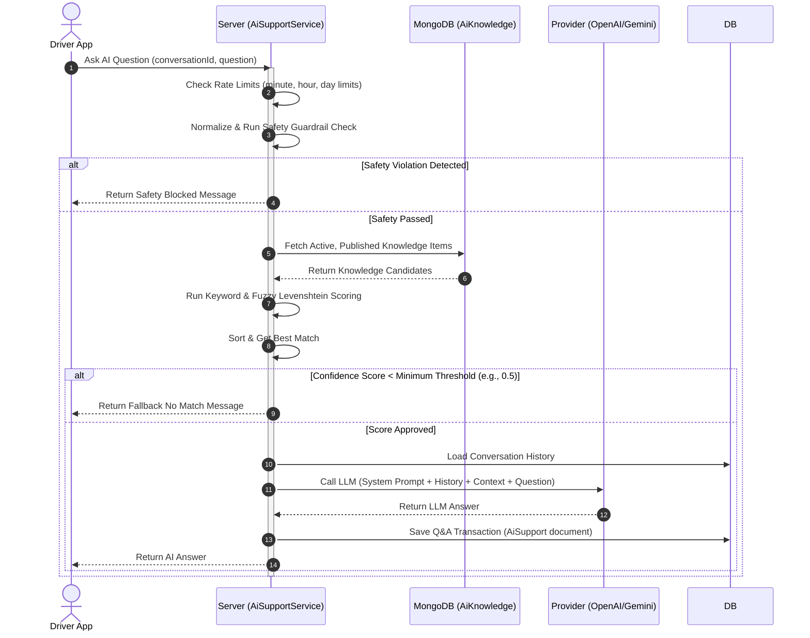
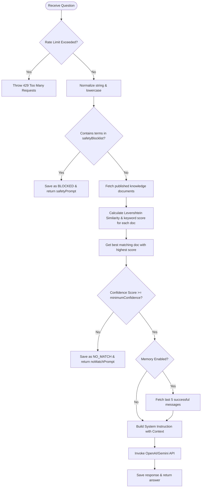
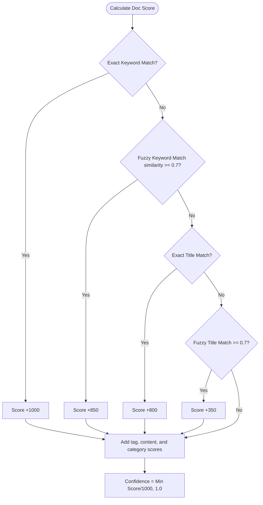

# AI Support System

This document describes the AI Support System, including database models, safety filters, fuzzy keyword matching algorithms, prompt construction, conversation history limiters, and OpenAI/Gemini integration.

---

## 1. Business Overview

### Plain English Summary
The **AI Support System** acts as an automated virtual helper for drivers. Instead of requiring human agents to answer every question about platform rules, policies, or vehicle requirements, drivers can ask the AI directly.

The AI is strictly guided by the platform's **Knowledge Base**—an approved repository of company documentation created and published by admins. To ensure accuracy and security:
- The system checks every question for malicious prompts (like trying to hack the system or get user passwords) and blocks them.
- It scans the knowledge base using a scoring algorithm to find the most relevant document.
- It sends only that specific document to the AI engine (OpenAI or Gemini) and instructs it to answer the question using *only* that context.
- If the system cannot find a matching document with a high enough confidence score, it declines to answer and redirects the driver to human support.

---

## 2. Technical Overview

### Architecture
The AI Support System uses a retrieval-augmented generation (RAG) style pipeline. It uses keyword matching and Levenshtein distance calculations to rank documents before calling the LLM provider.

```
                           +-------------------+
                           |    Driver App     |
                           +---------+---------+
                                     | (Ask Question)
                                     v
                           +-------------------+
                           | AI Support Service|
                           +---------+---------+
                                     |
           +-------------------------+-------------------------+
           | (Safety Guardrail)                                | (Retrieve Docs)
           v                                                   v
+-------------------+                               +-------------------+
|  Safety Blocklist |                               |   AiKnowledge     |
|  Check            |                               |   Collection      |
+-------------------+                               +---------+---------+
                                                               |
                                                               v (Scoring & Rank)
                                                    +---------+---------+
                                                    |  Semantic Scoring |
                                                    |  Algorithm        |
                                                    +---------+---------+
                                                               |
                                                               v (Provide Context)
                                                    +---------+---------+
                                                    | Provider Factory  |
                                                    | (OpenAI / Gemini) |
                                                    +-------------------+
```

---

## 3. Database Design

### Collections & Key Fields

#### `aiknowledges` Collection
Stores approved documentation snippets.
- `_id`: `ObjectId`
- `title`: `String`
- `module`: `String` (e.g., `"ride"`, `"payout"`, `"duty_hours"`)
- `category`: `String`
- `content`: `String` (Markdown formatted doc)
- `searchableContent`: `String`
- `tags`: `Array` of `String`
- `keywords`: `Array` of `String`
- `priority`: `Number`
- `isActive`: `Boolean`
- `status`: `String` (Enum: `draft`, `under_review`, `published`, `archived`)
- `isLatest`: `Boolean`
- `createdBy`: `ObjectId` -> References `User`

#### `aisuports` Collection
Stores each Q&A interaction.
- `driverId`: `ObjectId` -> References `User`
- `conversationId`: `ObjectId` -> References `AiConversation`
- `question`: `String`
- `normalizedQuestion`: `String`
- `answer`: `String`
- `aiModel`: `String` (e.g., `"gpt-4"`, `"gemini-1.5-pro"`, `"guard-rail"`)
- `confidenceScore`: `Number` (0.0 to 1.0)
- `responseStatus`: `String` (Enum: `success`, `blocked`, `no_match`)
- `responseSource`: `String` (Enum: `ai`, `fallback`)
- `responseTimeMs`: `Number`

#### `aiconversations` Collection
Groups Q&A exchanges.
- `driverId`: `ObjectId` -> References `User`
- `title`: `String`
- `isArchived`: `Boolean`

#### `aiauditlogs` Collection
Tracks admin and system edits.
- `action`: `String`
- `performedBy`: `ObjectId` -> References `User`
- `details`: `Object`

---

## 4. Complete Workflow



---

## 5. Internal Algorithms

### Fuzzy Matching & Safety Flowchart



### Levenshtein Distance & Fuzzy Match Formula
To compute the edit distance between strings:

$$D_{i,j} = \min \begin{cases} D_{i-1,j} + 1 \\ D_{i,j-1} + 1 \\ D_{i-1,j-1} + (s_1[i] \neq s_2[j]) \end{cases}$$

Fuzzy similarity is calculated as:

$$\text{Similarity}(s_1, s_2) = 1.0 - \frac{\text{LevenshteinDistance}(s_1, s_2)}{\max(\text{len}(s_1), \text{len}(s_2))}$$

---

## 6. Flowcharts

### Semantic Scoring Calculations



---

## 7. Sequence Diagrams

*Detailed in Section 4.*

---

## 8. State Diagrams

*Not applicable as AI operations are stateless, transactional evaluations.*

---

## 9. API & Socket Interaction

### API: Ask AI Question
`POST /api/v1/ai-support/ask`
- **Request Payload**:
```json
{
  "conversationId": "64ca8e836940d9c49a62657d",
  "question": "What is the maximum shift limit?",
  "language": "en"
}
```

- **Response Payload**:
```json
{
  "success": true,
  "data": {
    "question": "What is the maximum shift limit?",
    "answer": "According to the platform rules, the maximum daily driving shift is 10 hours. Once reached, you will be taken offline until midnight.",
    "confidenceScore": 1.0,
    "responseStatus": "success",
    "aiModel": "gemini-1.5-pro",
    "responseTimeMs": 420
  }
}
```

---

## 10. Calculations

### Rate Limiting Calculations
- The system stores limits (e.g. `maxQuestionsPerMinute: 5`, `maxQuestionsPerHour: 20`, `dailyLimit: 100`).
- When a driver asks a question, the system queries the `aisuports` collection:
  - `minCount` = Count of documents with `driverId` in the last 60 seconds.
  - `hourCount` = Count in the last 1 hour.
  - `dayCount` = Count in the last 24 hours.
- If any count is greater than the configured threshold, the request is blocked.

---

## 11. Matching Logic

The matching logic selects the single best knowledge document by sorting candidates descending by `confidenceScore`. Only the top document is parsed as LLM context to optimize context windows and prevent hallucination.

---

## 12. Timezone Handling

Audit log entries are stored in UTC. Date queries for hourly and daily limits use the client request timezone (defaulting to UTC).

---

## 13. Security & Fraud Prevention

- **Prompt Injection Filter**: Normalizes inputs to support English and Bengali characters while stripping special characters. It scans for injection keywords (such as `ignore previous instructions`, `jailbreak`, `SQL`) and blocks them.
- **Strict Context Enforcement**: The system instructions explicitly direct the LLM: *“Analyze the context above and answer the user question strictly using it. Do not invent details.”*

---

## 14. Performance & Optimizations

- **Fuzzy Search Over Vector Search**: Fuzzy keyword matching avoids the latency and cost of vector database calculations, maintaining database search times under 10ms.
- **Index Optimization**: Extensive compound indexing on `isActive`, `status`, `isLatest`, and `module` filters candidates quickly.
