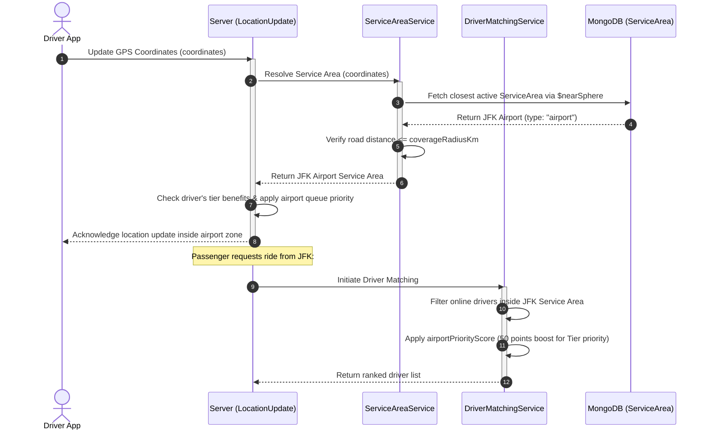
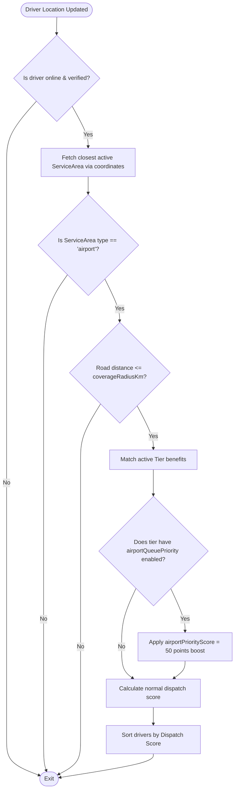
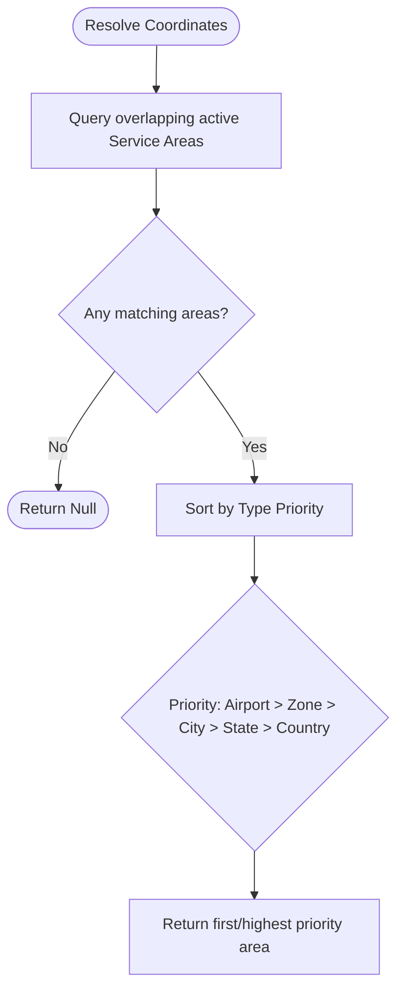
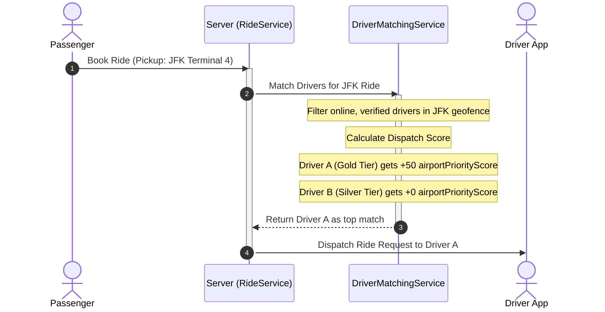

# Airport System

This document describes the design and implementation of the Airport System, covering geofencing, detection, driver queue prioritization, tier benefits, and matching workflows.

---

## 1. Business Overview

### Plain English Summary

Airports represent high-volume transit hubs with complex logistics. To prevent overcrowding, traffic congestion, and ensure a fair booking process, the system uses an **Airport Queue System**.

When drivers enter the geofenced airport area, they join a virtual queue. Instead of dispatching rides to the driver who happens to be closest to the passenger at the terminal, the system matches rides in a first-in, first-out (FIFO) queue order.

Drivers with premium tiers (such as Gold or Platinum) receive priority benefits, allowing them to skip spots in the queue or receive a dispatch score boost when matches are calculated.

---

## 2. Technical Overview

### Architecture

The Airport System integrates with the **ServiceArea** geofence module and **DriverMatchingService** to manage driver priority and queues.

```
+------------------+      (Coordinates check)      +--------------------+
|  Driver Location  | ----------------------------> | ServiceAreaService |
|      Update      |                               | (findServiceArea)  |
+------------------+                               +---------+----------+
                                                             |
                                                             v (Check Type: "airport")
                                                   +---------+----------+
                                                   | Dynamic Queue &    |
                                                   | Priority Dispatch  |
                                                   +--------------------+
```

---

## 3. Database Design

### Collections & Key Fields

#### `serviceareas` Collection (Airport type)

- `_id`: `ObjectId`
- `airport`: `String` (Name of the airport, e.g. "JFK International Airport")
- `type`: `String` (Enum value: `airport`)
- `location`: `{ type: "Point", coordinates: [Lng, Lat] }` (Geofence center point)
- `coverageRadiusKm`: `Number` (Geofence boundary radius, e.g. `10` km)
- `timezone`: `String` (IANA timezone, e.g., `"America/New_York"`)
- `status`: `String` (Enum: `active`, `inactive`)

#### `tiers` Collection

Defines rewards and queue boosts for drivers.

- `airportQueuePriority`:
  - `enabled`: `Boolean`
  - `priorityPosition`: `Number` (Priority queue position adjustment boost)

### Database Relationships

- **Drivers**: Drivers update their live GPS location coordinates, which are mapped to the airport geofence using geospatial `$nearSphere` queries.
- **Rides**: Rides originating from airport coordinates trigger airport-specific pricing and matching queues.

### Database Indexes

- Indexes on `serviceareas`:
  - `{ location: "2dsphere" }` (Allows querying coordinates inside the airport geofence)
  - `{ type: 1, status: 1 }` (Filters active airports)

---

## 4. Complete Workflow



---

## 5. Internal Algorithms

### Airport Detection & Queue Priority Algorithm

The system detects if a driver is within the airport zone and calculates their dispatch priority score.



---

## 6. Flowcharts

### Service Area Priority Resolution



---

## 7. Sequence Diagrams

### Dispatch Matching Sequence



---

## 8. State Diagrams

_Not applicable. Airport queues are calculated dynamically during matching updates._

---

## 9. API & Socket Interaction

### API: Get Active Airports

`GET /api/v1/service-areas/airports/:cityId`

- **Response Payload**:

```json
{
  "success": true,
  "data": [
    {
      "_id": "64ca10bc9318b76c02a83210",
      "airport": "John F. Kennedy International Airport",
      "cityId": "64ca00bc9318b76c02a83200",
      "type": "airport",
      "location": {
        "type": "Point",
        "coordinates": [-73.7781, 40.6413]
      },
      "coverageRadiusKm": 10,
      "timezone": "America/New_York",
      "status": "active"
    }
  ]
}
```

---

## 10. Calculations

### Dispatch Score with Airport Priority Example

Assuming:

- **Driver A**: Gold Tier (Airport priority enabled, boost = 50), distance to pickup = 2.0km, rating = 4.8.
- **Driver B**: Silver Tier (Airport priority disabled, boost = 0), distance to pickup = 0.5km, rating = 4.9.

#### Driver A Dispatch Score:

- Distance Score = $100 - (2.0 \times 10) = 80$
- Rating Score = $4.8 \times 10 = 48$
- Tier Level Boost = $3 \times 15 = 45$
- Airport Queue Score = $50$
- **Total Score = 223**

#### Driver B Dispatch Score:

- Distance Score = $100 - (0.5 \times 10) = 95$
- Rating Score = $4.9 \times 10 = 49$
- Tier Level Boost = $2 \times 15 = 30$
- Airport Queue Score = $0$
- **Total Score = 174**

_Driver A is matched first despite being further away due to the airport priority boost._

---

## 11. Matching Logic

### Prioritization Hierarchy

1. **Airport Geofence Match**: Driver must be inside the airport geofence.
2. **Tier Priority**: Gold/Platinum drivers get a 50-point boost, positioning them at the front of the queue.
3. **FIFO Proximity**: Proximity and queue enter time resolve tie-breaks.

---

## 12. Timezone Handling

Timezones are resolved from the airport `ServiceArea` document. Daily limits and reservations are computed based on the resolved timezone.
