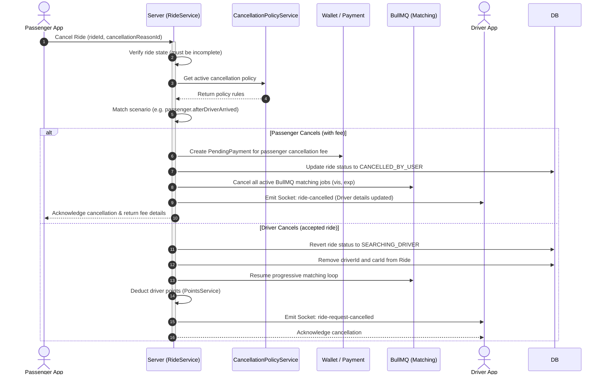
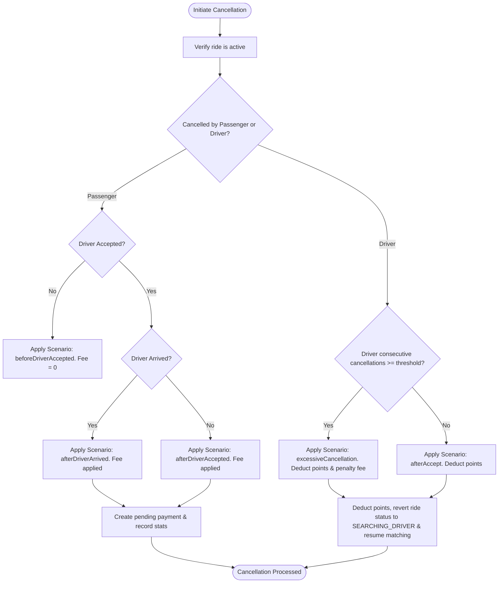
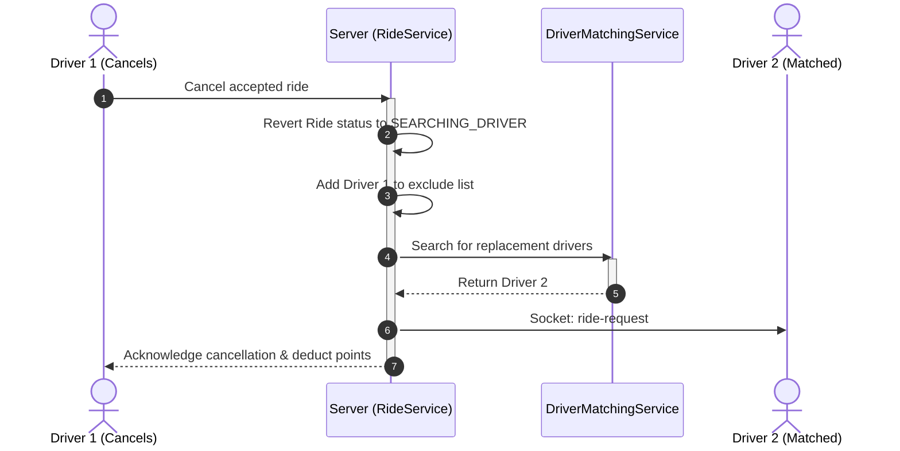

# Cancellation System

This document describes the Cancellation System, covering passenger and driver cancellations, fee scenarios, wallet payments, points adjustments, and matching re-runs.

---

## 1. Business Overview

### Plain English Summary
Rides can be cancelled by either passengers or drivers. To prevent abuse, the platform applies **cancellation fees and penalties** based on the stage of the ride:
- **Before Acceptance**: Passengers can cancel for free.
- **After Acceptance**: If a passenger cancels after a driver has accepted (and spent time driving towards them), a fee is applied.
- **After Arrival**: If a passenger cancels after the driver has arrived at the pickup location, a higher fee is applied.
- **Driver Cancellations**: Drivers are penalized for cancelling rides they have already accepted. Penalties include points deductions, impact on their driver rating, and potential temporary suspension if they exceed cancellation thresholds.

Fees collected from passengers are split between the platform share and driver compensation.

---

## 2. Technical Overview

### Architecture
Cancellations are managed in the **Ride Service** using database transactions to update ride states, record financial changes (via the Wallet and PendingPayment modules), adjust driver points, and resume matching if a driver cancels.

```
+------------------+
| Passenger/Driver |
|  Cancel Request  |
+---------+--------+
          |
          v
+---------+--------+      (Apply Scenario Rules)      +--------------------+
|   Ride Service   | -------------------------------> | CancellationPolicy |
|  (cancelRide)    |                                  +--------------------+
+---------+--------+
          |
          v (Financial & Point Transactions)
+---------+--------+
| Wallet / Points  |
|  Services        |
+---------+--------+
          |
          v (Real-time updates)
+---------+--------+
| Sockets & Push   |
| Notifications    |
+------------------+
```

---

## 3. Database Design

### Collections & Key Fields

#### `cancellationpolicies` Collection
Defines fee rules for different scenarios.
- `passenger`:
  - `beforeDriverAccepted`: `{ cancellationFee: Number, platformShare: Number, driverCompensation: Number }`
  - `afterDriverAccepted`: `{ cancellationFee: Number, platformShare: Number, driverCompensation: Number }`
  - `afterDriverArrived`: `{ cancellationFee: Number, platformShare: Number, driverCompensation: Number }`
- `driver`:
  - `afterAccept`: `{ cancellationFee: Number, platformShare: Number }`
  - `excessiveCancellation`: `{ cancellationFee: Number, platformShare: Number }`
  - `excessiveCancellationThreshold`: `Number` (e.g. `3`)

#### `rides` Collection (Cancellation fields)
- `cancellation`:
  - `cancelledBy`: `String` (Enum: `passenger`, `driver`, `admin`)
  - `cancellationReasonId`: `ObjectId`
  - `cancellationReasonName`: `String`
  - `cancellationFee`: `Number`
  - `driverCompensation`: `Number`
  - `platformShare`: `Number`
  - `paymentStatus`: `String` (Enum: `pending`, `paid`)
  - `paymentCollectionMode`: `String` (Enum: `immediate`, `next_ride`)
  - `cancelledAt`: `Date`

#### `pendingpayments` Collection
Tracks outstanding cancellation fees to collect.
- `userId`: `ObjectId`
- `rideId`: `ObjectId`
- `type`: `String` (`"cancellation_fee"`)
- `amount`: `Number`
- `status`: `String` (Enum: `pending`, `paid`)

---

## 4. Complete Workflow



---

## 5. Internal Algorithms

### Cancellation Handling Logic
The system evaluates the rules and processes cancellations.



---

## 6. Flowcharts

### Financial Fee Splits

| Scenario | Cancellation Fee | Platform Share | Driver Compensation |
| :--- | :--- | :--- | :--- |
| **Passenger before acceptance** | $0.00 | $0.00 | $0.00 |
| **Passenger after acceptance** | $5.00 * surge | $1.50 * surge | $3.50 * surge |
| **Passenger after arrival** | $8.00 * surge | $2.00 * surge | $6.00 * surge |
| **Driver after acceptance** | $0.00 | $0.00 | $0.00 (Points deducted) |

---

## 7. Sequence Diagrams

### Re-matching After Driver Cancellation



---

## 8. State Diagrams

*Detailed in the Driver Matching System documentation.*

---

## 9. API & Socket Interaction

### API: Cancel Ride
`POST /api/v1/rides/cancel/:rideId`
- **Request Payload**:
```json
{
  "cancellationReasonId": "64ca9e836940d9c49a62657e",
  "cancellationReasonName": "Change of plans",
  "paymentTiming": "next_ride"
}
```

- **Response Payload**:
```json
{
  "success": true,
  "data": {
    "_id": "64c8f00ca83210bc9318b21e",
    "status": "cancelled_by_user",
    "cancellation": {
      "cancelledBy": "passenger",
      "cancellationFee": 5.00,
      "driverCompensation": 3.50,
      "platformShare": 1.50,
      "paymentStatus": "pending",
      "paymentCollectionMode": "next_ride"
    }
  }
}
```

---

## 10. Calculations

### Surge Multiplier Cancellation Fee Example
If a passenger cancels a ride after the driver has arrived, and the ride was booked during a surge multiplier of `1.5x`:
- Base Scenario Fee = `$8.00`
- Applied Surge Multiplier = `1.5`

$$\text{Total Fee} = 8.00 \times 1.5 = \$12.00$$
$$\text{Platform Share} = 2.00 \times 1.5 = \$3.00$$
$$\text{Driver Compensation} = 6.00 \times 1.5 = \$9.00$$

---

## 11. Matching Logic

When a driver cancels, they are added to the ride's `excludeDriverIds` array, ensuring they are not matched again when search matching resumes.

---

## 12. Timezone Handling

Timestamps (`cancelledAt`, `lastCancellationTime`) are stored in UTC. Local timezone offsets are resolved from the Service Area to compute historical statistics and metrics.

---

## 13. Security & Fraud Prevention

- **Verification**: Only the ride owner (passenger) or assigned driver can execute cancellations.
- **Abuse Prevention**: If a passenger frequently cancels after driver arrival, their account is flagged, and immediate fee collection is enforced before they can book another ride.

---

## 14. Performance & Optimizations

- **Atomic Transactions**: MongoDB sessions wrap all updates, ensuring consistency between ride status changes, pending payments, and point deductions.
- **Asynchronous Processing**: Background workers process points deductions and notifications out-of-band to minimize response latency.
