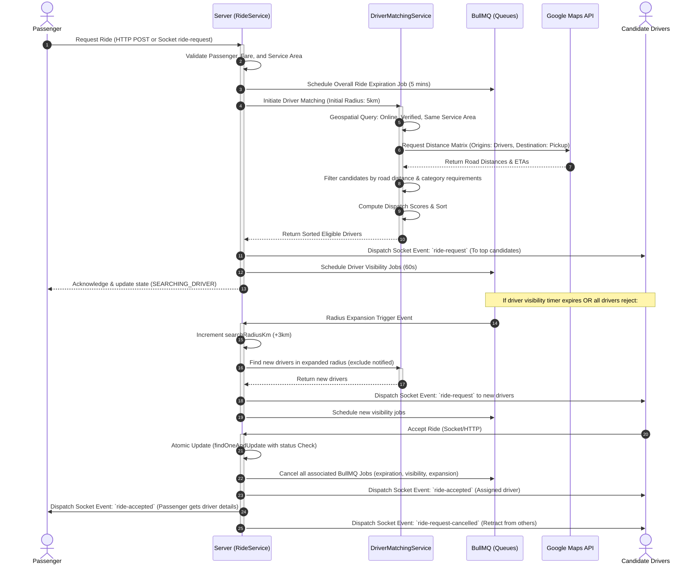
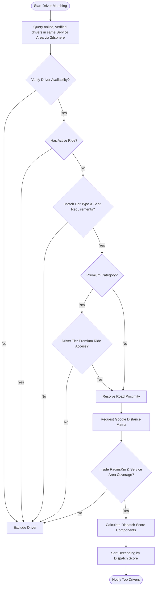
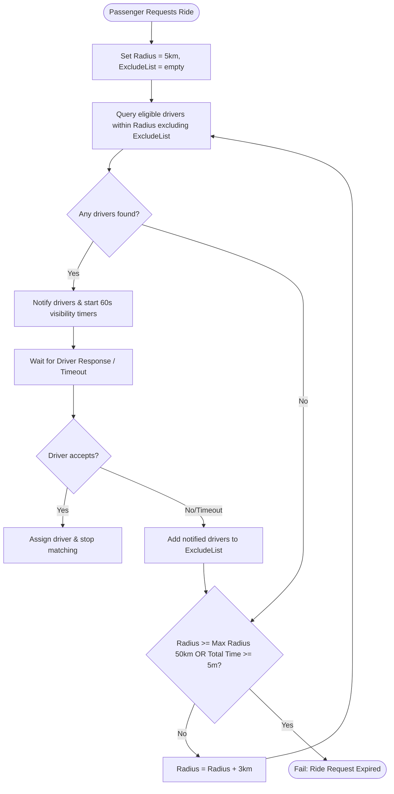
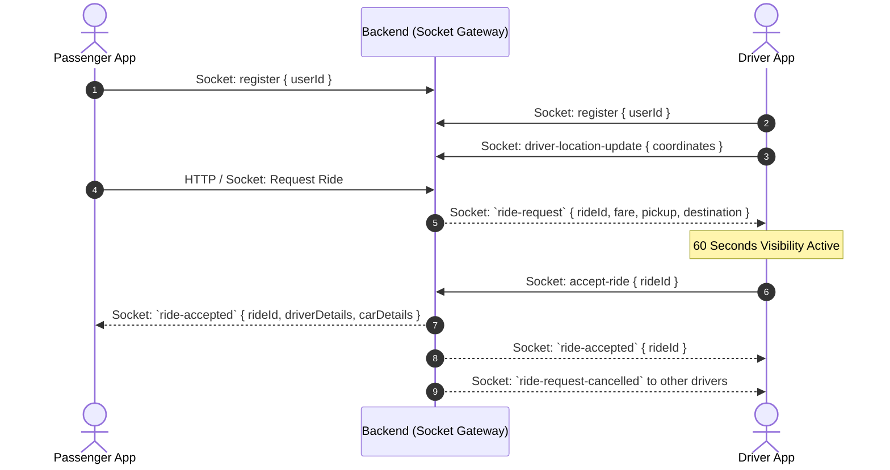
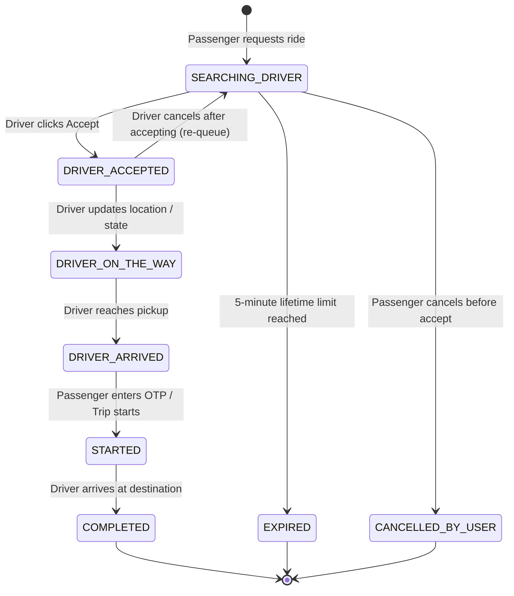

# Driver Matching System

This document describes the Progressive Driver Matching System designed and implemented for the ride-sharing platform. The system facilitates real-time, low-latency, and progressive proximity-based driver assignment.

---

## 1. Business Overview

### Plain English Summary
When a passenger requests a ride, the platform searches for the best available driver nearby. Instead of checking a massive radius immediately, the system uses a **progressive radius search**. It starts looking within a small area (e.g., 5km). If no driver accepts the request within a short timeframe (e.g., 60 seconds), or if all drivers in that area decline, the system immediately expands the search radius (e.g., adding 3km) to find more drivers. This loop continues until a driver accepts the ride or a maximum search time (typically 5 minutes) is reached.

To ensure the best experience, drivers are not selected at random. They are ranked using a **Dispatch Score** that prioritizes drivers who are:
- Closer to the pickup location (lower road distance).
- Highly rated.
- Consistent in accepting rides (good acceptance rates).
- Members of premium reward tiers.
- Driving in directions matching their pre-configured destinations (Destination Filters).

The first driver who accepts the ride request in the app is assigned, and the request is immediately retracted from other screens to prevent race conditions.

---

## 2. Technical Overview

### Architecture
The driver matching system is built around an event-driven, asynchronous workflow using **Node.js, Express, MongoDB (Mongoose)**, and **BullMQ/Redis** for queue management. Real-time updates and notifications flow over **Socket.io**.

```
                           +-------------------+
                           |   Passenger App   |
                           +---------+---------+
                                     | (Socket: ride-request / HTTP)
                                     v
                           +-------------------+
                           |    Ride Service   |
                           +---------+---------+
                                     |
           +-------------------------+-------------------------+
           | (Schedule Jobs)                                   | (Query Candidates)
           v                                                   v
+-------------------+                               +-------------------+
|      BullMQ       |                               |  Driver Matching  |
|  - ride-expire    |                               |      Service      |
|  - driver-vis     |                               +---------+---------+
|  - rad-expand     |                                         |
+-------------------+                                         | (Google Distance Matrix API)
                                                              v
                                                    +-------------------+
                                                    | Google Route Serv |
                                                    +-------------------+
```

#### Core Components:
1. **Driver Matching Service (`src/services/driverMatchingService.ts`)**: Core logic to query eligible drivers from MongoDB, evaluate geofences, invoke the Google Maps Route API, and rank drivers using the dispatch score.
2. **BullMQ Queues & Workers (`src/config/bullmq.ts` & `src/workers/rideMatchingWorkers.ts`)**:
   - `ride-expiration`: Tracks overall ride request lifetime (e.g., 5 mins). Expired rides transition to `EXPIRED`.
   - `driver-visibility`: Tracks individual driver request visibility (60 seconds per driver). If the driver doesn't accept, visibility expires.
   - `radius-expansion`: Triggers progressive expansion when visibility timeouts or manual rejections occur.
3. **Socket Helper (`src/helpers/socketHelper.ts`)**: Dispatches real-time events to passenger and driver apps.

---

## 3. Database Design

### Database Collections & Key Fields

#### `rides` Collection
Represents the state and parameters of a ride request.
- `_id`: `ObjectId` (Primary Key)
- `userId`: `ObjectId` -> References `User` (Passenger)
- `driverId`: `ObjectId` -> References `User` (Assigned Driver, optional)
- `status`: `String` (Enum: `SEARCHING_DRIVER`, `DRIVER_ACCEPTED`, `DRIVER_ON_THE_WAY`, `DRIVER_ARRIVED`, `STARTED`, `COMPLETED`, `CANCELLED`, `EXPIRED`)
- `serviceAreaId`: `ObjectId` -> References `ServiceArea`
- `pickup`: `{ location: { type: "Point", coordinates: [Lng, Lat] }, address: String }`
- `destination`: `{ location: { type: "Point", coordinates: [Lng, Lat] }, address: String }`
- `fare`: `{ total: Number, base: Number, surgeMultiplier: Number }`
- `driverMatching`:
  - `searchRadiusKm`: `Number` (Current search radius)
  - `notifiedDrivers`: `Array` of:
    - `driverId`: `ObjectId` -> References `User`
    - `sentAt`: `Date`
    - `respondedAt`: `Date`
    - `status`: `String` (Enum: `SENT`, `ACCEPTED`, `REJECTED`, `EXPIRED`)

#### `drivers` Collection
Represents the driver profile and real-time state.
- `_id`: `ObjectId`
- `userId`: `ObjectId` -> References `User` (Role: `driver`)
- `location`: `{ type: "Point", coordinates: [Lng, Lat], address: String }`
- `driverAvailabilityStatus`: `String` (Enum: `online`, `offline`, `break`, `suspended`)
- `taxVerified`: `Boolean`
- `taxVerificationStatus`: `String` (`verified`)
- `serviceAreaId`: `ObjectId` -> References `ServiceArea`
- `currentTier`: `ObjectId` -> References `Tier`
- `averageRating`: `Number`
- `availability`: `{ canReceiveRide: Boolean, blockedReason: String, blockedUntil: Date }`

#### `cars` Collection
Represents the verified vehicle.
- `_id`: `ObjectId`
- `driverId`: `ObjectId` -> References `Driver`
- `carType`: `String` (e.g. `economy`, `premium`, `suv`)
- `seatNumber`: `Number`
- `isVerified`: `Boolean`

### Database Relationships
```
[User] (Passenger) <1 --- 1..*> [Ride]
[User] (Driver) <1 --- 1> [Driver] <1 --- 1..*> [Car]
[ServiceArea] <1 --- 0..*> [Ride]
[ServiceArea] <1 --- 0..*> [Driver]
[Tier] <1 --- 0..*> [Driver]
```

### Database Indexes
- **`rides`**:
  - `{ status: 1, requestedAt: -1 }` (To quickly retrieve searching rides)
  - `{ driverId: 1, status: 1 }` (To check for active rides for a driver)
- **`drivers`**:
  - `{ location: "2dsphere" }` (Geospatial lookup)
  - `{ driverAvailabilityStatus: 1, taxVerified: 1, serviceAreaId: 1 }` (Filters active eligible drivers)

---

## 4. Complete Workflow



---

## 5. Internal Algorithms

### Proximity & Eligibility Flowchart



### Detailed Dispatch Score Ranking Logic
The `Dispatch Score` determines which driver is matched first. The score is calculated as follows:

$$\text{Dispatch Score} = \text{distanceScore} + \text{ratingScore} + \text{acceptanceScore} + \text{tierPriorityScore} + \text{destMatchScore} + \text{airportPriorityScore}$$

#### Component Weights and Formulations:

| Score Component | Maximum Points | Calculation Formula / Rule |
| :--- | :--- | :--- |
| **Distance Score** | 100 | `Math.max(0, 100 - (roadDistanceKm * 10))` |
| **Rating Score** | 50 | `averageRating * 10` (Assuming rating is 0 to 5) |
| **Acceptance Score** | 50 | `acceptanceRate * 0.5` (Where acceptanceRate is 0 to 100) |
| **Tier Priority Score**| Variable | `(tierLevel * 15) + (priorityDispatchBoost)` |
| **Destination Score** | 100 | Cosine Similarity relative direction: up to `100` points |
| **Airport Queue Score**| 50 | `50` points boost if pickup is in airport service area |

#### Tie-breaking Rules:
If two drivers achieve the exact same dispatch score:
1. **Tier Level**: The driver with the higher loyalty tier wins.
2. **Proximity**: The driver with the shortest Google Maps road distance wins.
3. **Acceptance Rate**: The driver with the higher historical acceptance rate wins.

---

## 6. Flowcharts

### Progressive Expansion Loop



---

## 7. Sequence Diagrams

### Interactive Socket-to-Socket Flow



---

## 8. State Diagrams

### Ride Matching State Transitions



---

## 9. API & Socket Interaction

### Socket API Payload Specifications

#### 1. Server → Client: `ride-request` (Sent to Candidate Drivers)
```json
{
  "rideId": "64b0f9836940d9c49a62654b",
  "rideType": "instant",
  "pickup": {
    "address": "123 Main St, New York, NY",
    "location": {
      "type": "Point",
      "coordinates": [-73.935242, 40.730610]
    }
  },
  "destination": {
    "address": "456 Broadway, New York, NY",
    "location": {
      "type": "Point",
      "coordinates": [-73.996728, 40.718826]
    }
  },
  "fare": 24.50,
  "driverSearch": {
    "radiusKm": 5,
    "visibilitySeconds": 60
  },
  "user": {
    "name": "Jane Doe",
    "profileImage": "https://url.com/profile.jpg",
    "rating": 4.8
  }
}
```

#### 2. Client → Server: `accept-ride` (From Driver)
```json
{
  "rideId": "64b0f9836940d9c49a62654b"
}
```

#### 3. Server → Client: `ride-accepted` (Sent to Passenger)
```json
{
  "rideId": "64b0f9836940d9c49a62654b",
  "status": "driver_accepted",
  "driver": {
    "name": "John Smith",
    "profileImage": "https://url.com/john.jpg",
    "phone": "+15555551234",
    "rating": 4.9
  },
  "car": {
    "brand": "Toyota",
    "model": "Prius",
    "color": "Silver",
    "licensePlate": "XYZ-1234"
  },
  "price": 24.50,
  "estimatedArrivalMinutes": 6,
  "remainingDistanceKm": 2.1
}
```

---

## 10. Calculations

### Dispatch Score: Detailed Vector Calculations

#### Distance Score:
```typescript
const distanceScore = Math.max(0, 100 - distanceToPickup * 10);
// Example: If distance is 2.5km
// distanceScore = 100 - (2.5 * 10) = 75 points
```

#### Destination Filter Vector & Angle Calculation:
When a driver uses a Destination Filter, the system calculates the angle between:
- **Vector A**: The vector pointing from the ride pickup location to the ride destination.
- **Vector B**: The vector pointing from the ride pickup location to the driver's configured filter destination.

```typescript
const vecPR = [rideDestLng - pickupLng, rideDestLat - pickupLat]; // Ride vector
const vecPF = [filterDestLng - pickupLng, filterDestLat - pickupLat]; // Filter vector

const magPR = Math.sqrt(vecPR[0]**2 + vecPR[1]**2);
const magPF = Math.sqrt(vecPF[0]**2 + vecPF[1]**2);

let destMatchScore = 0;
if (magPR > 0 && magPF > 0) {
  const dotProduct = vecPR[0] * vecPF[0] + vecPR[1] * vecPF[1];
  const cosSim = dotProduct / (magPR * magPF); // Cosine of the angle between vectors

  if (cosSim > 0) {
    const distDestToFilter = calculateDistance(rideDestLat, rideDestLng, filterDestLat, filterDestLng);
    const distPickupToFilter = calculateDistance(pickupLat, pickupLng, filterDestLat, filterDestLng);

    // Ensure the ride brings the driver closer to their target
    if (distDestToFilter < distPickupToFilter) {
      destMatchScore = cosSim * 50; // Heading alignment contribution
      if (distDestToFilter <= filterRadiusKm) {
        // Boost if ride drops off within filter radius
        destMatchScore += (1 - distDestToFilter / filterRadiusKm) * 50;
      }
    }
  }
}
```

---

## 11. Matching Logic

### Prioritization Hierarchy
1. **Active Filter Constraints**: Drivers with Destination Filters are only matched if the ride takes them closer to their filter coordinates.
2. **Eligibility Filtering**: Driver status must be `online`, car type must match ride category, seat capacity must be sufficient, and driver must have active premium authorization if it's a premium request.
3. **Dispatch Scoring Sorting**: Sorted descending by computed dispatch score.

### Tie-Breaking Scenarios

| Driver A | Driver B | Result & Explanation |
| :--- | :--- | :--- |
| Dispatch Score: **85** (2km, Tier 2) | Dispatch Score: **85** (1.5km, Tier 1) | **Driver A wins** because tier level priority (boost level) is evaluated first in tie-breaking. |
| Dispatch Score: **80** (2.5km, Tier 1) | Dispatch Score: **80** (2.8km, Tier 1) | **Driver A wins** because of closer road distance proximity. |

---

## 12. Timezone Handling

### Temporal Resolution Flow
1. All timestamps are persisted in MongoDB as UTC Dates (`ISODate`).
2. When query filters occur (like calculating driving hour thresholds or scheduling reservation bookings), the timezone of the **Service Area** where the request originates is retrieved (e.g., `America/New_York`).
3. Luxon resolves localized boundaries:
   ```typescript
   const localNow = DateTime.now().setZone(timezone);
   const localMidnightUTC = localNow.startOf("day").toUTC().toJSDate();
   ```
4. This ensures day-boundary computations are contextually aligned with local policies.

---

## 13. Security & Fraud Prevention

- **Exclusion List Persistence**: A driver who rejects a ride request or lets their 60-second visibility timer expire is added to the `excludeDriverIds` array inside the ride matching metadata. This ensures they are not re-notified in subsequent progressive expansions.
- **Race Condition Prevention via MongoDB Transactions**:
  Ride acceptance uses an atomic conditional check to block multiple drivers from matching simultaneously:
  ```typescript
  const ride = await Ride.findOneAndUpdate(
    {
      _id: rideId,
      status: RIDE_STATUS.SEARCHING_DRIVER,
      driverId: { $exists: false }
    },
    {
      $set: {
        status: RIDE_STATUS.DRIVER_ACCEPTED,
        driverId: driverUserId,
        acceptedAt: new Date()
      }
    },
    { new: true, session }
  );
  ```
  If `driverId` is already set or status is not `SEARCHING_DRIVER`, the operation returns null and the second driver's attempt is rejected.

---

## 14. Performance & Optimizations

- **Geospatial Indexing**: MongoDB `2dsphere` index allows microsecond-level proximity indexing of online drivers.
- **Google Distance Matrix Optimization**: Google distance matrix calculates distances in batch rather than checking individual routes sequentially.
- **Exclusion Indexing**: The query excludes notified driver IDs directly in MongoDB using `$nin` operator over indexed fields.

