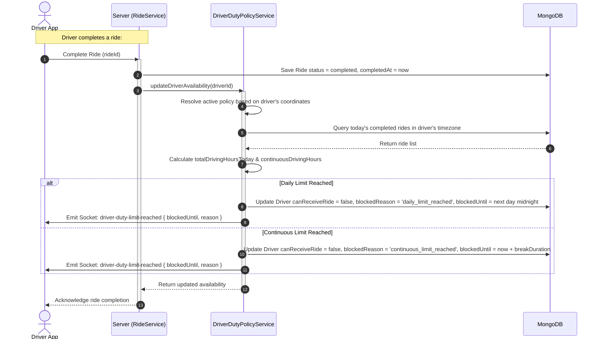
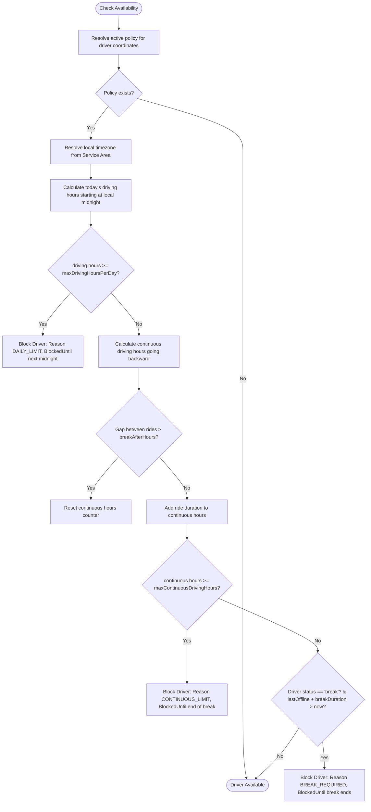
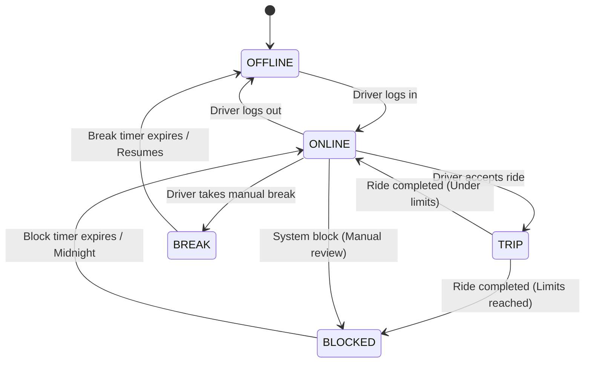
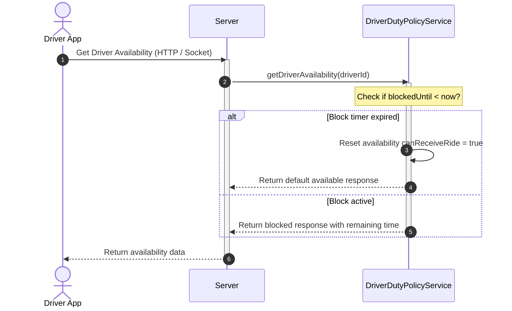

# Driver Duty Hour Restriction

This document describes the Driver Duty Hour Restriction System, which monitors and limits driver shifts to prevent fatigue, comply with regulatory requirements, and ensure safety.

---

## 1. Business Overview

### Plain English Summary
To prevent driver fatigue, the system monitors driving hours. If a driver drives for too long, they are temporarily blocked from receiving new ride requests. 

The system enforces three main limits:
1. **Daily Driving Limit**: The maximum hours a driver can drive in a single day (e.g., 10 hours). If they reach this limit, they are blocked until midnight in their local timezone.
2. **Continuous Driving Limit**: The maximum hours a driver can drive continuously without a break (e.g., 4 hours). If they reach this limit, they must take a break of a specified duration (e.g., 30 minutes) before they can receive rides again.
3. **Break Status**: Drivers can manually go offline for a break. The system prevents them from coming back online until their required break duration has finished.

---

## 2. Technical Overview

### Architecture
The duty hour system is event-driven. Instead of running heavy cron jobs every minute, driver availability is recalculated during key events (such as when a ride starts, completes, or is cancelled).

```
+--------------------+
|  Ride Completion/  |
|  Status Change     |
+---------+----------+
          |
          v
+---------+----------+      (Lookup policy)      +--------------------+
| DriverDutyPolicy   | ------------------------> | DriverDutyPolicy   |
|     Service        |                           | (Database Model)   |
+---------+----------+
          |
          v (Recalculate availability)
+---------+----------+
|  updateDriver      |
|  Availability      |
+---------+----------+
          |
          v (Availability changed)
+---------+----------+
| Socket Emit:       |
| 'driver-duty-limit'|
+--------------------+
```

---

## 3. Database Design

### Collections & Key Fields

#### `driverdutypolicies` Collection
Defines the duty hour rules for a location.
- `_id`: `ObjectId`
- `name`: `String`
- `scopeType`: `String` (e.g. `"city"`, `"airport"`)
- `cityId`: `ObjectId` -> References `ServiceArea` (Optional)
- `airportId`: `ObjectId` -> References `ServiceArea` (Optional)
- `maxDrivingHoursPerDay`: `Number` (e.g. `10`)
- `maxContinuousDrivingHours`: `Number` (e.g. `4`, set to `0` to disable)
- `breakAfterHours`: `Number` (Continuous driving limit trigger, e.g. `4`)
- `breakDurationMinutes`: `Number` (Required break time, e.g. `30`)
- `status`: `String` (Enum: `active`, `inactive`)

#### `drivers` Collection (Duty Fields)
- `availability`:
  - `canReceiveRide`: `Boolean`
  - `blockedReason`: `String` (Enum: `daily_limit_reached`, `continuous_limit_reached`, `break_required`)
  - `blockedUntil`: `Date`
- `driverAvailabilityStatus`: `String` (Enum: `online`, `offline`, `break`)
- `lastOfflineAt`: `Date` (Used to track break start time)

### Database Relationships
- **ServiceArea**: The driver's current coordinates resolve their `ServiceArea`, which determines the active `DriverDutyPolicy` to apply.

### Database Indexes
- `{ status: 1, cityId: 1, airportId: 1 }` (To quickly retrieve policies based on location)

---

## 4. Complete Workflow



---

## 5. Internal Algorithms

### Driver Availability Calculation Logic
When availability is updated, the system evaluates all policy rules.



---

## 6. Flowcharts

### Driver Shifts & Breaks State Diagram



---

## 7. Sequence Diagrams

### Automatic Resume Flow



---

## 8. State Diagrams

*Detailed in Section 6.*

---

## 9. API & Socket Interaction

### Socket Event: `driver-duty-limit-reached`
Sent to the driver when a shift limit is reached:
```json
{
  "canReceiveRide": false,
  "blockedReason": "daily_limit_reached",
  "blockedUntil": "2026-07-28T00:00:00.000Z",
  "remainingHours": 16,
  "remainingMinutes": 5,
  "remainingSeconds": 30
}
```

---

## 10. Calculations

### Continuous Driving Calculation Example
Assuming:
- Policy: `maxContinuousDrivingHours: 4`, `breakAfterHours: 2`, `breakDurationMinutes: 30`.
- Completed Rides (Reverse chronological order):
  1. Ride A: Started 15:00, Completed 16:30 (Duration: 1.5 hrs)
  2. Ride B: Started 13:00, Completed 14:30 (Duration: 1.5 hrs) - Gap to Ride A: 30 mins (Under 2 hrs break threshold)
  3. Ride C: Started 10:00, Completed 12:00 (Duration: 2.0 hrs) - Gap to Ride B: 1 hour (Under 2 hrs break threshold)

*Continuous driving time = 1.5 + 1.5 + 2.0 = 5.0 hours.*
Since 5.0 hours is greater than the 4.0-hour limit, the driver is blocked for 30 minutes starting from the completion of the last ride (16:30), meaning they are blocked until 17:00.

---

## 11. Matching Logic

Drivers with `availability.canReceiveRide == false` are automatically excluded from the geospatial queries in the matching service.

---

## 12. Timezone Handling

Shift midnight transitions must respect the local timezone where the driver operates:
1. All ride timestamps are saved in UTC.
2. The system resolves the timezone from the driver's location (e.g. `Asia/Dhaka`).
3. Computes the start of the day in that timezone using Luxon:
   ```typescript
   const localMidnightUTC = getCurrentTimeInTimezone(timezone)
     .startOf("day")
     .toUTC()
     .toJSDate();
   ```
4. Only rides completed after `localMidnightUTC` are included in the daily driving hour calculation.

---

## 13. Security & Fraud Prevention

- **Database Integrity**: Shift limits are validated and updated on the server, preventing drivers from spoofing their status to bypass limits.
- **Verification checks**: Ensures only verified drivers with active profiles are processed.

---

## 14. Performance & Optimizations

- **Aggregation Pipeline**: Uses aggregation lookup pipelines to filter and join ServiceArea and Policy parameters in a single database query.
- **Event-Driven Check**: Recalculates availability only on key status changes instead of running polling cron jobs.

