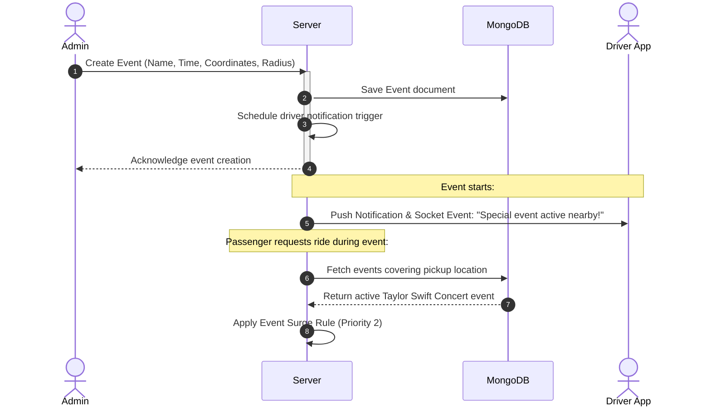
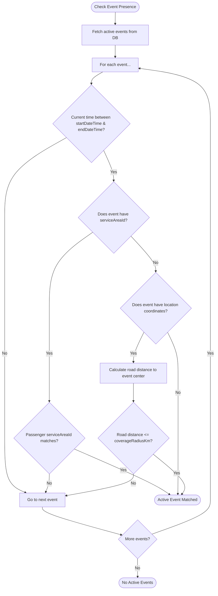
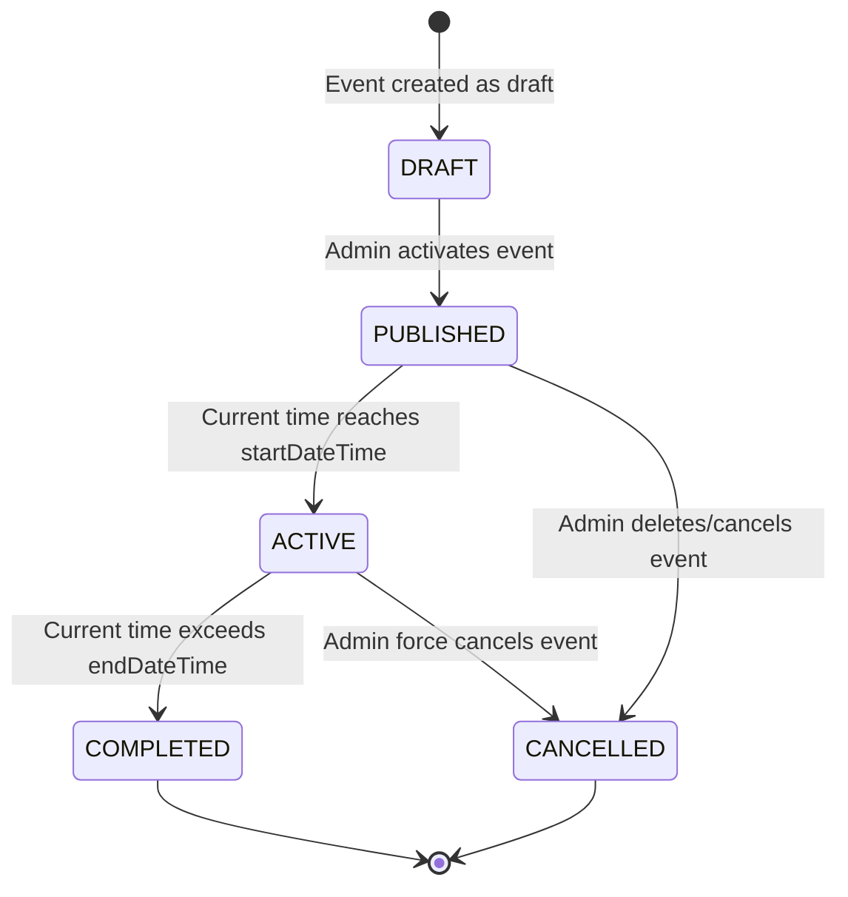
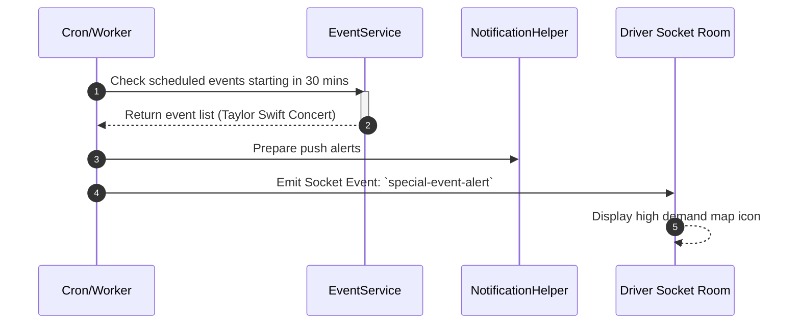

# Events System

This document outlines the design, architecture, and operation of the Events System. It highlights how city-wide or geofenced special events alter passenger pricing, dispatch priorities, and notifications.

---

## 1. Business Overview

### Plain English Summary

When major events occur (like sports games, concerts, festivals, or conferences), there is usually a massive spike in passenger demand in a concentrated area. The **Events System** allows admins to schedule special events with specific dates, times, and geofences (like a stadium with a 2km radius).

During an active event:

- Passengers in the event area may experience surge pricing to attract more drivers.
- Drivers are notified about high-demand zones to help them position their vehicles efficiently.
- Rides originating from the event zone are prioritized or matched according to the specific event rules.

---

## 2. Technical Overview

### Architecture

The Events System integrates with the **ServiceArea** geospatial module and **SurgeCalculationService** to apply multipliers when rides originate near event locations.

```
+------------------+      (Coordinates check)      +--------------------+
|  Passenger Ride  | ----------------------------> |   Event Service    |
|   Request Area   |                               |  (isEventActive)   |
+------------------+                               +---------+----------+
                                                             |
                                                             v (Geospatial match)
                                                   +---------+----------+
                                                   | MongoDB Event Coll |
                                                   | (2dsphere index)   |
                                                   +--------------------+
```

---

## 3. Database Design

### Collections & Key Fields

#### `events` Collection

Defines specific scheduled events.

- `_id`: `ObjectId`
- `eventName`: `String` (e.g., "Taylor Swift Concert")
- `description`: `String`
- `timezone`: `String` (IANA timezone identifier, e.g. `"America/Chicago"`)
- `startDateTime`: `Date` (UTC)
- `endDateTime`: `Date` (UTC)
- `serviceAreaId`: `ObjectId` -> References `ServiceArea` (Optional)
- `location`: `{ type: "Point", coordinates: [Lng, Lat] }` (Optional)
- `coverageRadiusKm`: `Number` (Geofence radius around location coordinates, optional)
- `status`: `String` (Enum: `active`, `inactive`)
- `createdBy`: `ObjectId` -> References `User`

### Database Relationships

- **ServiceArea**: Events can either be bound to an entire ServiceArea (like a city) or restricted to a specific geofenced location.
- **SurgeRule**: The `SurgeCalculationService` checks for active events to resolve the event-specific surge rules.

### Database Indexes

- `{ location: "2dsphere" }` (Allows querying events covering passenger coordinate lookups)
- `{ status: 1, startDateTime: 1, endDateTime: 1 }` (To quickly retrieve active scheduled events)

---

## 4. Complete Workflow



---

## 5. Internal Algorithms

### Geospatial Event Matching Logic

When a ride request is processed, the system determines if the pickup coordinates fall within any active event's geofenced area.



---

## 6. Flowcharts

### Event Lifecycle States



---

## 7. Sequence Diagrams

### Driver Broadcast Flow



---

## 8. State Diagrams

_Not applicable. State transitions are detailed in Section 6._

---

## 9. API & Socket Interaction

### API: Create Event (Admin Only)

`POST /api/v1/events`

- **Request Payload**:

```json
{
  "eventName": "Lollapalooza Festival",
  "description": "Music festival at Grant Park",
  "timezone": "America/Chicago",
  "startDateTime": "2026-08-01T12:00:00Z",
  "endDateTime": "2026-08-03T23:59:00Z",
  "location": {
    "type": "Point",
    "coordinates": [-87.619, 41.8758]
  },
  "coverageRadiusKm": 2.5
}
```

- **Response Payload**:

```json
{
  "success": true,
  "data": {
    "_id": "64cb207ca83210bc9318c21a",
    "eventName": "Lollapalooza Festival",
    "status": "active"
  }
}
```

---

## 10. Calculations

### Geofenced Event Surge Interpolation

If a passenger requests a ride from a location 1.5km away from the Grant Park coordinates:

- The event has `coverageRadiusKm: 2.5`.
- Active Rule: **Event Rule** (`minMultiplier: 1.5`, `maxMultiplier: 3.0`).
- Since the pickup is within 2.5km, the system selects the Event Surge Rule and calculates the multiplier based on the marketplace ratio.

---

## 11. Matching Logic

During active events, the system priorities drivers who are moving toward the event zone. It will rank candidates in the event area higher in the dispatch scoring to resolve congestion.

---

## 12. Timezone Handling

1. Event start/end times are configured in the localized timezone (e.g. `America/Chicago`) and stored as UTC dates in the database.
2. The comparison is evaluated using Luxon:
   ```typescript
   const nowInTimezone = DateTime.now().setZone(event.timezone);
   const startInTimezone = DateTime.fromJSDate(event.startDateTime).setZone(
     event.timezone,
   );
   const endInTimezone = DateTime.fromJSDate(event.endDateTime).setZone(
     event.timezone,
   );
   const isActive =
     nowInTimezone >= startInTimezone && nowInTimezone <= endInTimezone;
   ```

---

## 13. Security & Fraud Prevention

- **Radius Caps**: Admins cannot create events with coverage radius values larger than 15km to prevent accidental citywide surge locks.
- **Validation**: Coordinates are verified to prevent malformed or invalid geospatial inputs.

---

## 14. Performance & Optimizations

- **Geospatial Queries**: Uses MongoDB `$geoWithin` or `$nearSphere` queries to fetch candidate events instead of fetching all events and calculating distances in-memory.
- **Compound Indexes**: Combined status and time index queries execute in less than 2ms.
