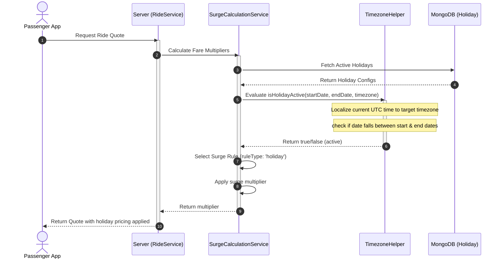
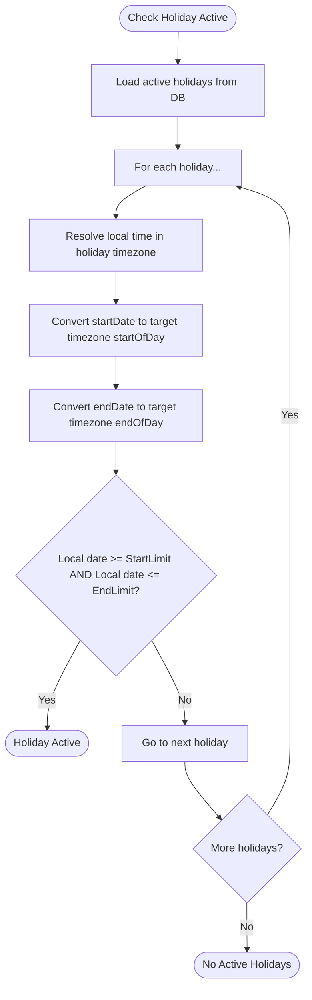
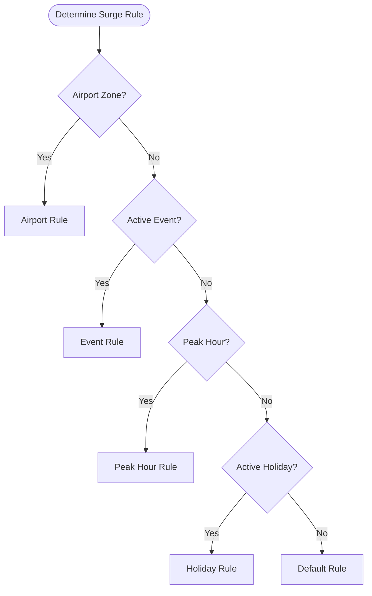
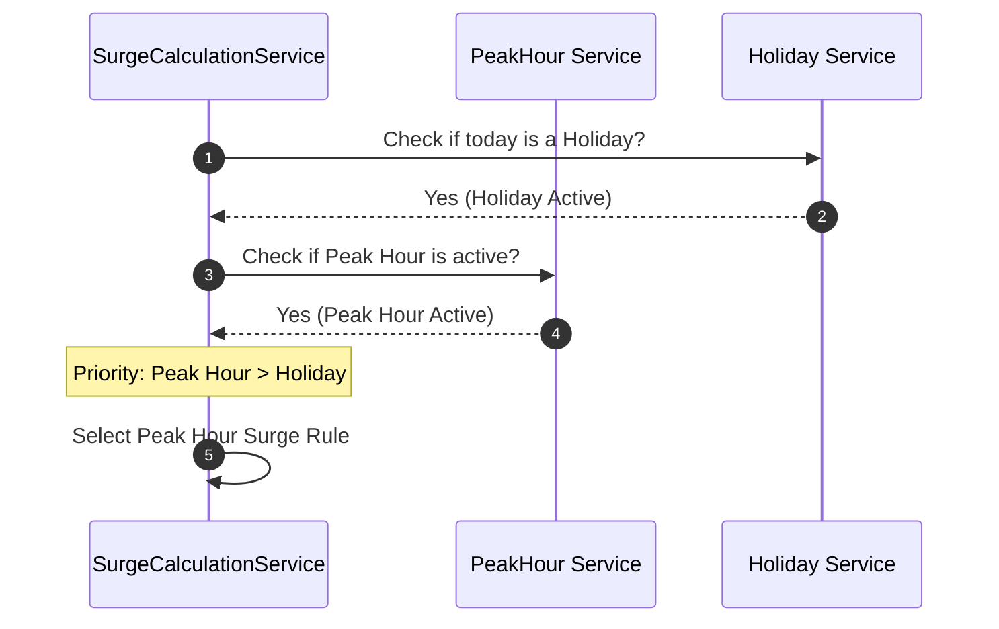

# Holiday System  

This document describes the Holiday System, covering how holidays are registered, timezone boundaries are resolved, and how holiday rules interact with the surge pricing engine.

---

## 1. Business Overview

### Plain English Summary
A **Holiday** represents a calendar day (like Christmas, New Year's Day, or Thanksgiving) when city transit patterns change. The platform allows admins to configure holidays. During a holiday, normal commute rules are typically overridden, and a custom holiday surge pricing rule is applied.

Holidays can be:
- **Full Day**: Active from midnight to 11:59 PM in the target timezone.
- **Partial Day**: Active only during specific hours (e.g., New Year's Eve from 6:00 PM onwards).

The system automatically checks if the current day is a holiday for the passenger's location and adjusts pricing accordingly.

---

## 2. Technical Overview

### Architecture
The Holiday system uses **Luxon** to compare dates while respecting localized timezone offset boundaries.

```
+--------------------+
|  Surge Calculation |
|      Service       |
+---------+----------+
          |
          v (Query Active Holidays)
+---------+----------+
|   Holiday Model    |
| (status: 'active') |
+---------+----------+
          |
          v (Evaluate Boundaries)
+---------+----------+
|   isHolidayActive  |
+--------------------+
```

---

## 3. Database Design

### Collections & Key Fields

#### `holidays` Collection
Defines holiday intervals.
- `_id`: `ObjectId`
- `holidayName`: `String` (e.g., "Independence Day")
- `timezone`: `String` (IANA timezone identifier, e.g., `"America/New_York"`)
- `startDate`: `Date` (UTC)
- `endDate`: `Date` (UTC)
- `description`: `String`
- `status`: `String` (Enum: `active`, `inactive`)
- `createdBy`: `ObjectId` -> References `User`

### Database Relationships
- The system determines the timezone of a ride by fetching its `ServiceArea`.
- Holidays are evaluated by converting the current UTC time into the service area's localized timezone and checking if it falls within the holiday window.

### Database Indexes
- `{ status: 1, startDate: 1, endDate: 1 }` (Allows quick lookups of active holiday dates)

---

## 4. Complete Workflow



---

## 5. Internal Algorithms

### Holiday Range Validation
The `isHolidayActive` algorithm resolves temporal boundaries in the target timezone.



---

## 6. Flowcharts

### Multi-Rule Precedence



---

## 7. Sequence Diagrams

### Overlap Priority Handling



---

## 8. State Diagrams

*Not applicable as Holidays are static calendar intervals.*

---

## 9. API & Socket Interaction

### API: Create Holiday (Admin Only)
`POST /api/v1/holidays`
- **Request Payload**:
```json
{
  "holidayName": "Christmas Day",
  "timezone": "America/New_York",
  "startDate": "2026-12-25T00:00:00Z",
  "endDate": "2026-12-25T23:59:59Z",
  "description": "Christmas public holiday"
}
```

- **Response Payload**:
```json
{
  "success": true,
  "data": {
    "_id": "64cd308ca83210bc9318c32b",
    "holidayName": "Christmas Day",
    "status": "active"
  }
}
```

---

## 10. Calculations

### Holiday Surge Multiplier Calculation
If a passenger requests a ride on Christmas Day:
- The system detects the active holiday.
- Active Rule: **Holiday Rule** (`minMultiplier: 1.3`, `maxMultiplier: 2.2`).
- The multiplier is calculated based on the supply/demand ratio and bound between 1.3 and 2.2.

---

## 11. Matching Logic

Holidays do not directly alter the matching priority order of drivers. However, they alter driver supply levels due to holiday surge rates, which indirectly affects matching speeds.

---

## 12. Timezone Handling

Holidays resolve localized calendar dates:
1. `startDate` and `endDate` are stored as UTC dates in the database.
2. The comparison is evaluated using Luxon:
   ```typescript
   const nowInTimezone = DateTime.now().setZone(timezone);
   const startInTimezone = DateTime.fromJSDate(startDate).setZone(timezone).startOf("day");
   const endInTimezone = DateTime.fromJSDate(endDate).setZone(timezone).endOf("day");
   const nowStart = nowInTimezone.startOf("day");
   const isActive = nowStart >= startInTimezone && nowStart <= endInTimezone;
   ```

---

## 13. Security & Fraud Prevention

- **Validation**: Strict validation of `startDate` and `endDate` intervals to prevent creating holidays with end dates prior to start dates.
- **Admin Access**: All endpoints are protected by role-based authorization rules (`ADMIN`/`SUPER_ADMIN`).

---

## 14. Performance & Optimizations

- **Indexing**: Database indexes on `status`, `startDate`, and `endDate` keep query times under 2ms.
- **Caching**: Holiday data is queried efficiently using lean operations.

