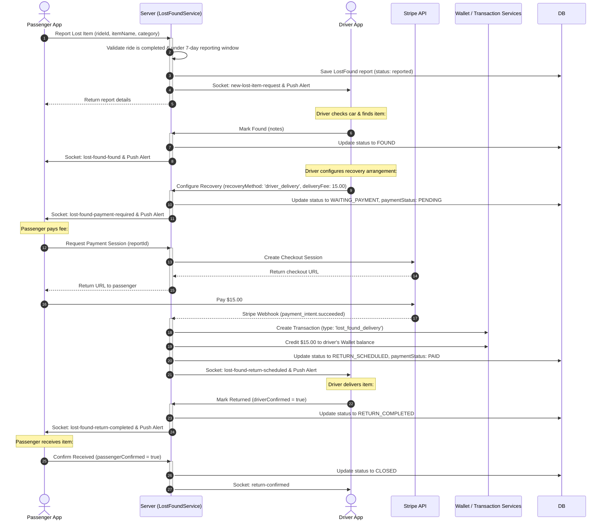
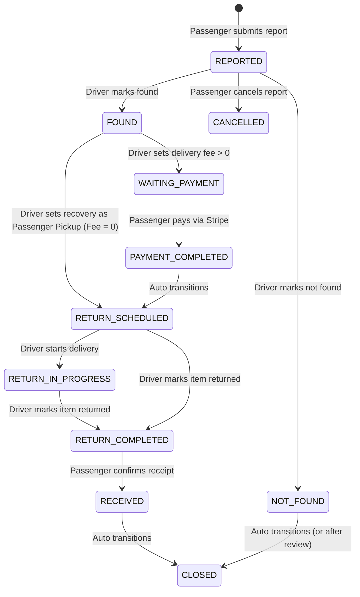

# Lost & Found System 

This document describes the Lost & Found System, including passenger and driver flows, status lifecycles, delivery configurations, and payments integration.

---

## 1. Business Overview

### Plain English Summary
It is common for passengers to accidentally leave items in vehicles. The **Lost & Found System** provides a structured way to report and return lost items.

- **Passengers** can report lost items from their completed rides, providing descriptions and pictures.
- **Drivers** are notified. They check their vehicle and mark the item as either **Found** or **Not Found**.
- If the item is found, the driver and passenger arrange the return:
  - **Passenger Pickup**: The passenger picks up the item from the driver for free.
  - **Driver Delivery**: The driver delivers the item to the passenger. The driver can specify a delivery fee to compensate for their time.
- If a delivery fee is specified, the passenger must pay it (via Stripe) before the driver delivers the item. The fee is added to the driver's wallet once the return is confirmed.

---

## 2. Technical Overview

### Architecture
The Lost & Found module integrates with the **Ride**, **Wallet**, **Transaction**, and **Stripe** modules. Real-time updates are synchronized via WebSockets and push notifications.

```
+--------------------+
|  Passenger/Driver  |
|  Lost-Found Action |
+---------+----------+
          |
          v
+---------+----------+      (Payment Checkout)      +--------------------+
|  Lost & Found Serv | ---------------------------> |   Stripe Service   |
+---------+----------+                              +---------+----------+
          |                                                   |
          v (Webhook: payment success)                        |
+---------+----------+                                        |
| Transaction &      | <--------------------------------------+
| Wallet Updates     |
+---------+----------+
          |
          v (Real-time updates)
+---------+----------+
|  Socket Helper /   |
|  Push Notification |
+--------------------+
```

---

## 3. Database Design

### Collections & Key Fields

#### `lostfounds` Collection
Defines a lost & found case transaction.
- `_id`: `ObjectId`
- `rideId`: `ObjectId` -> References `Ride`
- `passengerId`: `ObjectId` -> References `User`
- `driverId`: `ObjectId` -> References `User`
- `reportNumber`: `String` (Unique alphanumeric identifier, e.g. `LF-20260727-4029`)
- `itemName`: `String`
- `itemCategory`: `ObjectId` -> References `LostAndFoundItemCategory`
- `itemDescription`: `String`
- `uploadedFiles`: `Array` of `{ fileUrl: String, fileName: String, uploadedAt: Date }`
- `reportStatus`: `String` (Enum: `reported`, `under_review`, `found`, `not_found`, `waiting_payment`, `payment_completed`, `return_scheduled`, `return_in_progress`, `return_completed`, `received`, `closed`, `cancelled`)
- `foundStatus`: `String` (Enum: `pending`, `found`, `not_found`)
- `recoveryMethod`: `String` (Enum: `passenger_pickup`, `driver_delivery`)
- `deliveryFee`: `Number`
- `paymentStatus`: `String` (Enum: `not_required`, `pending`, `paid`, `failed`, `refunded`)
- `paymentIntentId`: `String`
- `passengerConfirmed`: `Boolean`
- `driverConfirmed`: `Boolean`
- `auditLogs`: `Array` of `{ action: String, actor: ObjectId, actorRole: String, details: Object, timestamp: Date }`

---

## 4. Complete Workflow



---

## 5. Internal Algorithms

### Lost & Found Status Transitions
The lifecycle diagram below outlines the valid status transitions.



---

## 6. Flowcharts

*Detailed in Section 5.*

---

## 7. Sequence Diagrams

*Detailed in Section 4.*

---

## 8. State Diagrams

*Detailed in Section 5.*

---

## 9. API & Socket Interaction

### API: Submit Driver Rating
`POST /api/v1/lost-found/rate/:reportId`
- **Request Payload**:
```json
{
  "rating": 5,
  "review": "Fast delivery! Driver was super friendly."
}
```

- **Response Payload**:
```json
{
  "success": true,
  "data": {
    "_id": "64ca9e836940d9c49a62657d",
    "passengerConfirmed": true,
    "passengerRated": true,
    "passengerRating": 5,
    "passengerReview": "Fast delivery! Driver was super friendly."
  }
}
```

---

## 10. Calculations

### Stripe Payment & Driver Wallet Calculations
- **Delivery Fee**: `$15.00`
- **Platform Fee**: `$0.00` (100% of the delivery fee goes to the driver)
- **Stripe Transaction**: Passenger pays `$15.00` + payment processing fees.
- **Driver Credit**: Driver's wallet balance increases by `$15.00`:
  $$\text{New Wallet Balance} = \text{Current Balance} + \text{Delivery Fee}$$

---

## 11. Matching Logic

The Lost & Found system matches reports to rides using the `rideId`. Only the passenger who booked the ride can file a report, and only the driver assigned to that ride is notified.

---

## 12. Timezone Handling

All dates (`startDate`, `endDate`, timestamps) are stored in UTC.

---

## 13. Security & Fraud Prevention

- **Upload Restrictions**: Passengers can upload a maximum of `5` files (images or PDFs) to prevent storage abuse.
- **Validation**: Reports must be submitted within `7` days of ride completion. Duplicate reports for the same ride are blocked.

---

## 14. Performance & Optimizations

- **Indexing**: Database indexes on `rideId`, `reportStatus`, and `paymentStatus` optimize lookup performance.
- **Transactions**: Payment processing, transaction creation, and wallet updates are wrapped in MongoDB transactions.
