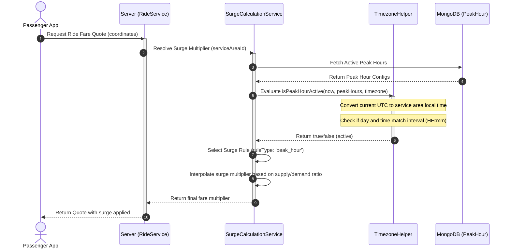
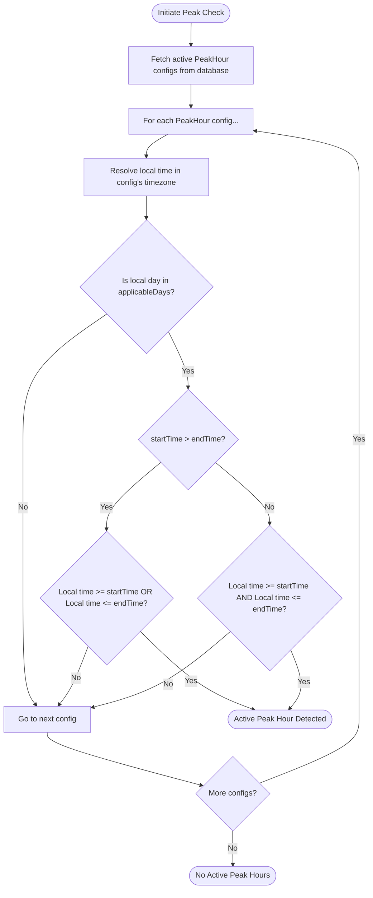
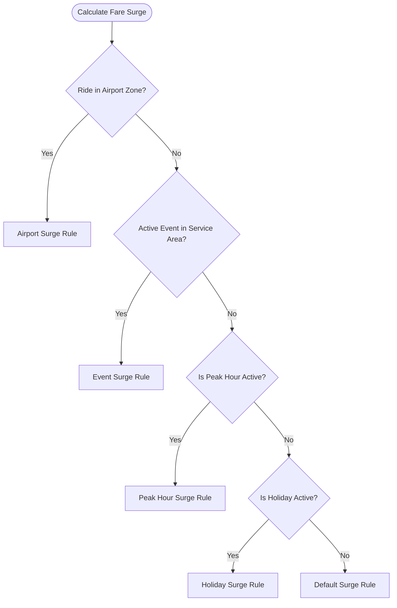
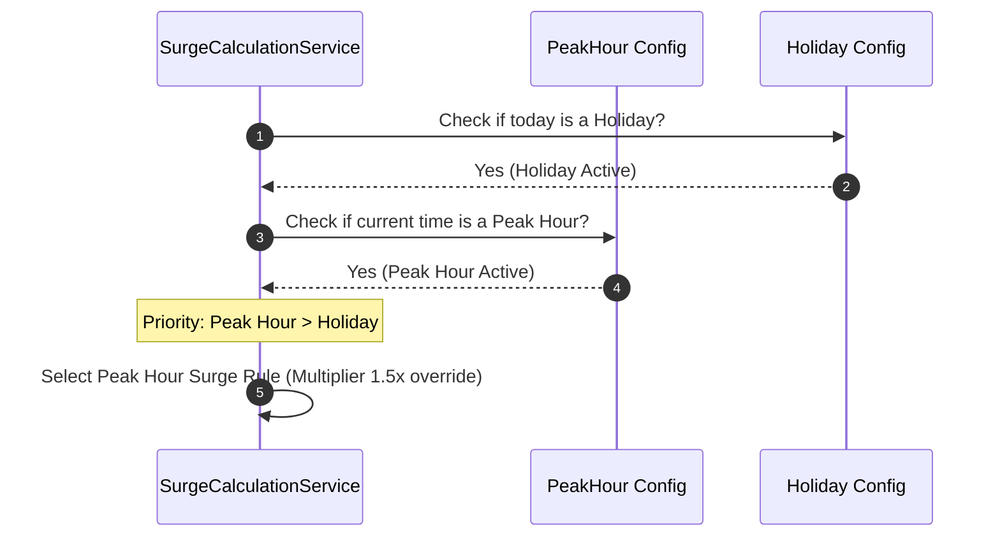

# Peak Hours System

This document describes the design and implementation of the Peak Hours system. It outlines how temporal boundaries are managed to regulate demand and supply dynamics through dynamic pricing modifiers.

---

## 1. Business Overview

### Plain English Summary

A **Peak Hour** represents a period of the day when ride demand is historically high (such as rush hours or weekend nights). During these hours, the system applies price increases (surge pricing multipliers) to balance demand and encourage more drivers to go online.

Admin users can define peak hours for specific days (e.g., Monday through Friday from 8:00 AM to 10:00 AM). The system automatically tracks what local time it is in the passenger's city, checks if that time falls inside any peak hours, and updates fares dynamically. If multiple peak hours overlap, or if they clash with holidays or special events, the system follows clear, pre-defined rules to decide which rule applies.

---

## 2. Technical Overview

### Architecture

The Peak Hours system relies on **Luxon** for timezone-aware date parsing. It compares the server's current UTC time against localized, text-based time slots (e.g., `"08:00"` to `"10:00"`) in the target city's timezone.

```
+--------------------+
|   Ride Booking/    |
|   Fare Request     |
+---------+----------+
          |
          v
+---------+----------+      (Lookup Timezone)      +--------------------+
|  Surge Calculation | --------------------------> |    ServiceArea     |
|      Service       |                             +--------------------+
+---------+----------+
          |
          v (Evaluate Active Peaks)
+---------+----------+
|  Timezone Helper   |
|  (isPeakHourActive)|
+---------+----------+
          |
          v (Apply rules)
+---------+----------+
|   Surge Rule Match |
+--------------------+
```

---

## 3. Database Design

### Collections & Key Fields

#### `peakhours` Collection

Defines specific recurring peak hour intervals.

- `_id`: `ObjectId`
- `name`: `String` (e.g., "Morning Rush Hour")
- `startTime`: `String` (HH:mm format, e.g. `"08:00"`)
- `endTime`: `String` (HH:mm format, e.g. `"10:00"`)
- `timezone`: `String` (IANA timezone identifier, e.g. `"America/New_York"`)
- `applicableDays`: `Array` of `String` (Enum: `sunday`, `monday`, `tuesday`, `wednesday`, `thursday`, `friday`, `saturday`)
- `status`: `String` (Enum: `active`, `inactive`)

#### `surgerules` Collection

Associates peak hours to surge factors.

- `ruleType`: `String` (Enum: `peak_hour`)
- `minMultiplier`: `Number` (e.g., `1.2`)
- `maxMultiplier`: `Number` (e.g., `2.0`)

### Database Relationships

- The system determines the timezone of a ride by fetching its `ServiceArea`.
- PeakHour documents are linked to Surge calculations dynamically using the timezone resolved from the `ServiceArea`.

### Database Indexes

- `{ status: 1 }` (To quickly retrieve all active configurations)

---

## 4. Complete Workflow



---

## 5. Internal Algorithms

### Active Peak Hours Detection

The system loads active peak hours, matches them against the passenger's local timezone, and determines if a peak hour is active.



### Overlap Priority Rules

If multiple peak hour configurations are active simultaneously:

1. **Duration Priority**: The configuration with the shorter duration (higher specificity) is chosen.
2. **Created Time**: If durations are equal, the newest configuration takes precedence.

---

## 6. Flowcharts

### Surge Multiplier Selection Order



---

## 7. Sequence Diagrams

### Temporal Overlap Decision Flow



---

## 8. State Diagrams

_Not applicable as Peak Hours are stateless, time-dependent evaluations._

---

## 9. API & Socket Interaction

### API Endpoint: Create Peak Hour (Admin only)

`POST /api/v1/peak-hours`

- **Request Payload**:

```json
{
  "name": "Evening Commute Peak",
  "startTime": "17:00",
  "endTime": "19:30",
  "timezone": "America/New_York",
  "applicableDays": ["monday", "tuesday", "wednesday", "thursday", "friday"]
}
```

- **Response Payload**:

```json
{
  "success": true,
  "message": "Peak hour created successfully",
  "data": {
    "_id": "64c92e92a83210bc9318b76c",
    "name": "Evening Commute Peak",
    "startTime": "17:00",
    "endTime": "19:30",
    "timezone": "America/New_York",
    "applicableDays": ["monday", "tuesday", "wednesday", "thursday", "friday"],
    "status": "active",
    "createdAt": "2026-07-27T02:00:00.000Z"
  }
}
```

---

## 10. Calculations

### Interpolated Surge Calculation Example

Assuming:

- Active Rule: **Peak Hour Rule** (`minMultiplier: 1.2`, `maxMultiplier: 2.0`).
- Driver marketplace ratio (Demand / Supply) = `2.5`.

$$\text{Clamped Ratio} = \min(2.5, 5.0) = 2.5$$
$$\text{Normalized Ratio} = \frac{2.5 - 0.8}{5.0 - 0.8} = \frac{1.7}{4.2} \approx 0.4048$$
$$\text{Smooth Progress} = (0.4048)^{0.7} \approx 0.5298$$
$$\text{Calculated Multiplier} = 1.0 + (0.5298 \times (2.0 - 1.0)) = 1.5298 \approx 1.53x$$

---

## 11. Matching Logic

Peak hours influence matching logic indirectly by increasing driver supply (due to higher surge pricing multipliers). This affects driver availability and matching priority.

---

## 12. Timezone Handling

### IANA Local Time Conversion

1. The server checks the current timestamp: `Date.now()`.
2. Luxon converts this to the target timezone:
   ```typescript
   const nowInTimezone = DateTime.now().setZone(timezone);
   const currentDayName = nowInTimezone.toFormat("EEEE").toLowerCase(); // "monday"
   const currentTimeStr = nowInTimezone.toFormat("HH:mm"); // "17:30"
   ```
3. Checks if `applicableDays` contains `currentDayName`.
4. Compares times:
   - For regular range (e.g., `17:00` to `19:30`): Checks if `"17:30"` is between `"17:00"` and `"19:30"`.
   - For overnight range (e.g., `22:00` to `02:00`): Checks if `"17:30" >= "22:00"` or `"17:30" <= "02:00"` (False).

---

## 13. Security & Fraud Prevention

- **Input Validation**: Strict validation using Zod schemas for the `"HH:mm"` time format to prevent malformed values.
- **Admin Authentication**: All peak hour modification endpoints are restricted to users with `ADMIN` or `SUPER_ADMIN` roles.

---

## 14. Performance & Optimizations

- **Database Cache**: Active Peak Hour intervals are cached in memory or queried efficiently using lean Mongo operations (`.find().lean()`).
- **Memory Consumption**: Evaluates time matching calculations in-memory rather than relying on heavy geospatial aggregation queries.
