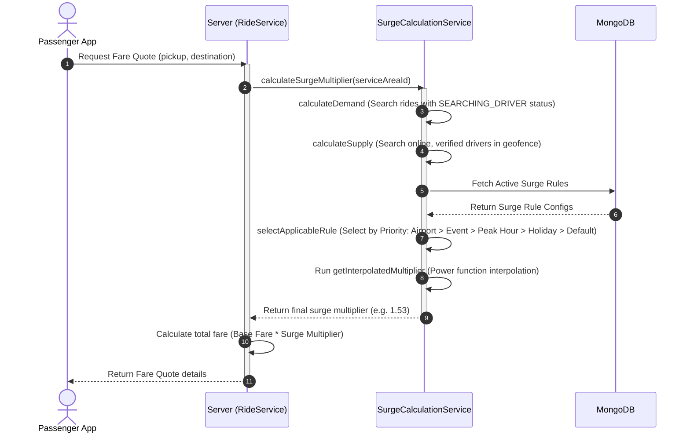
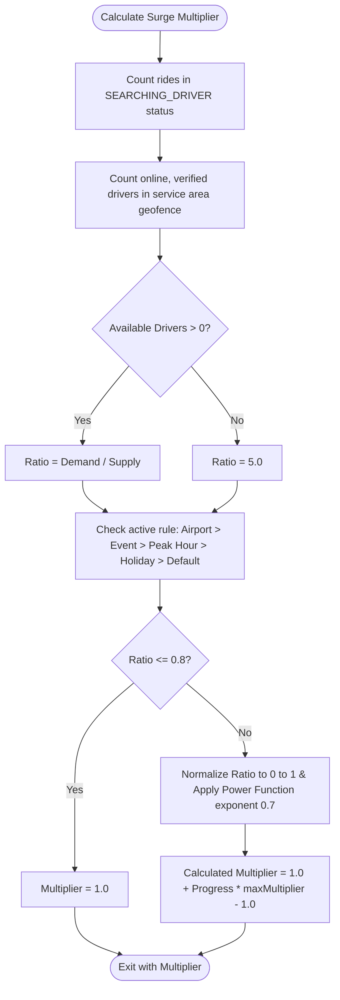
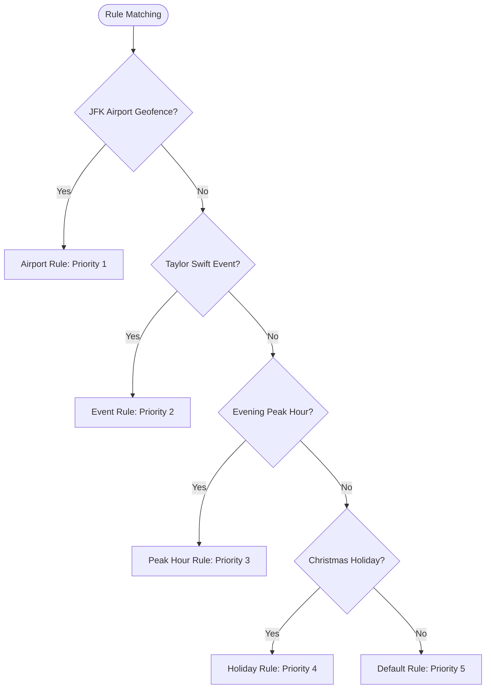

# Surge Pricing System  

This document describes the Surge Pricing System, covering dynamic calculation formulas, rule priority configurations, timezone offsets, and future weather integrations.

---

## 1. Business Overview

### Plain English Summary
At times of high demand (such as rush hour, bad weather, or major concerts), the number of passengers wanting a ride can exceed the number of available drivers nearby. To keep the platform reliable, the system uses **Surge Pricing**.

Surge pricing automatically increases fares. This serves two purposes:
1. It encourages more drivers to log in and drive in high-demand zones.
2. It allocates available rides to passengers who need them most.

The pricing modifier is calculated using the marketplace ratio (active ride requests divided by available drivers). Fares return to normal once the balance between passenger demand and driver supply is restored.

---

## 2. Technical Overview

### Architecture
The surge pricing engine dynamically evaluates active rules during fare quotes:

```
                           +-------------------+
                           |   Passenger App   |
                           |   (Fare Request)  |
                           +---------+---------+
                                     |
                                     v
                           +-------------------+
                           |   Ride Service    |
                           +---------+---------+
                                     |
                                     v (Calculate Multiplier)
                           +-------------------+
                           |  SurgeCalculation |
                           |      Service      |
                           +---------+---------+
                                     |
           +-------------------------+-------------------------+
           | (Fetch Active Rules)                              | (Evaluate Multiplier)
           v                                                   v
+-------------------+                               +-------------------+
|    SurgeRule      |                               |  Interpolated     |
|   Collection      |                               |  Multiplier       |
+-------------------+                               +-------------------+
```

---

## 3. Database Design

### Collections & Key Fields

#### `surgerules` Collection
- `_id`: `ObjectId`
- `ruleName`: `String` (e.g. `"Evening Commute Surge"`)
- `ruleType`: `String` (Enum: `airport_surge`, `event_surge`, `peak_hour_surge`, `holiday_surge`, `default_surge`)
- `demandThreshold`: `Number`
- `supplyThreshold`: `Number`
- `minMultiplier`: `Number` (e.g., `1.0`)
- `maxMultiplier`: `Number` (e.g., `3.0`)
- `status`: `String` (Enum: `active`, `inactive`)
- `createdBy`: `ObjectId` -> References `User`

### Database Relationships
- The surge calculation checks for active configurations in the `PeakHour`, `Holiday`, and `Event` collections using the passenger's `ServiceArea` coordinates and timezone.

### Database Indexes
- `{ ruleType: 1, status: 1 }` (To quickly retrieve active rules during pricing lookups)

---

## 4. Complete Workflow



---

## 5. Internal Algorithms

### Surge Rule Selection & Interpolation Flowchart



---

## 6. Flowcharts

### Rule Precedence Order



---

## 7. Sequence Diagrams

*Detailed in Section 4.*

---

## 8. State Diagrams

*Not applicable as Surge calculations are stateless, transactional evaluations.*

---

## 9. API & Socket Interaction

### API: Test Surge Calculation
`GET /api/v1/surge-rules/test/:serviceAreaId`
- **Response Payload**:
```json
{
  "success": true,
  "data": {
    "demand": 12,
    "supply": {
      "totalDrivers": 8,
      "availableDrivers": 5
    },
    "ratio": 2.4,
    "activeRuleType": "PEAK_HOUR",
    "activeRuleName": "Evening Commute Surge",
    "minMultiplier": 1.2,
    "maxMultiplier": 2.5,
    "finalMultiplier": 1.76
  }
}
```

---

## 10. Calculations

### Interpolated Surge Calculation Formula
The multiplier is calculated using a smooth power function curve:
- **Lower Bound Ratio**: `0.8` (Below this, surge = `1.0`)
- **Upper Bound Ratio**: `5.0` (Above this, surge = `maxMultiplier`)
- **Power Exponent (Smoothness)**: `0.7`

#### Calculation Steps:
1. Clamp Ratio:
   $$\text{Clamped Ratio} = \min(\max(\text{Ratio}, 0.8), 5.0)$$
2. Normalize Ratio:
   $$\text{Normalized Ratio} = \frac{\text{Clamped Ratio} - 0.8}{5.0 - 0.8}$$
3. Apply Power Function Exponent:
   $$\text{Progress} = (\text{Normalized Ratio})^{0.7}$$
4. Calculate Multiplier:
   $$\text{Multiplier} = 1.0 + \text{Progress} \times (\text{maxMultiplier} - 1.0)$$
5. Round to 2 decimal places.

---

## 11. Matching Logic

Surge multipliers encourage more drivers to head towards the surge zone. The system ranks matching drivers in high-surge areas higher in dispatch priority.

---

## 12. Timezone Handling

All calculations are evaluated in UTC. Timezones are resolved from the `ServiceArea` document to verify if localized rules (such as peak hours or holidays) apply to the passenger's local time.

---

## 13. Security & Fraud Prevention

- **Surge Caps**: Multipliers are capped at the rule's `maxMultiplier` to prevent extreme or incorrect pricing.
- **Verification checks**: Stale driver locations (older than 5 minutes) are excluded from supply calculations to prevent location spoofing.

---

## 14. Performance & Optimizations

- **Geospatial Queries**: Uses MongoDB `2dsphere` indexes to query candidate drivers and service areas within milliseconds.
- **Caching**: Surge rules and configurations are cached in-memory to minimize database query latency.